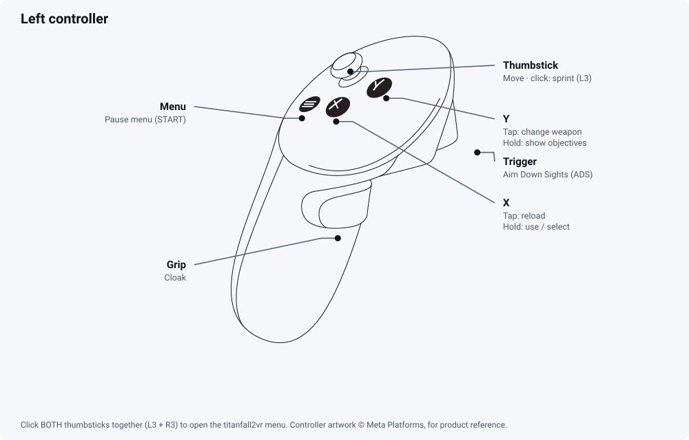
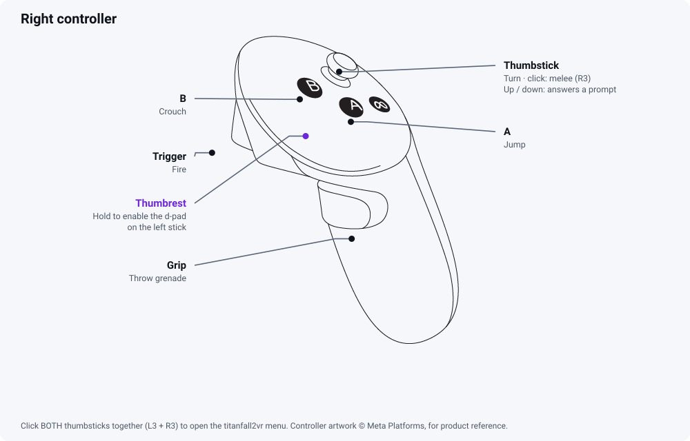

# Controls

Everything Titanfall 2 VR adds: what your **VR controllers** do, what the
**in-headset menu** contains, and what every setting in it means.

The short version: play with the controllers, and click **both thumbsticks
together** to open the menu.

- [VR controllers](#vr-controllers)
- [The in-headset menu](#the-in-headset-menu)
- [The d-pad modifier](#the-d-pad-modifier)
- [Settings reference](#settings-reference)

---

## VR controllers

titanfall2vr presents your controllers to Titanfall 2 as an Xbox pad, at the
game's own input seam. Everything below is the game's stock controller layout
reached through VR hardware, so your in-game controller bindings still apply.

| Input | Sends | In the game |
|---|---|---|
| Right trigger | RT | Fire |
| Left trigger | LT | Aim down sights (ADS) |
| Right **A** | A | Jump |
| Right **B** | B | Crouch |
| Left **X** | X | Tap: reload. Hold: use / select |
| Left **Y**, tapped | Y | Change weapon |
| Left **Y**, held | View (BACK) | Show the next objective |
| Left grip | Tactical ability | Cloak, in the campaign |
| Right grip | Ordnance | Throw a grenade |
| Left menu button | START | The game's pause menu |
| Left thumbstick | Left stick | Move |
| Left thumbstick click | L3 | Sprint |
| Right thumbstick, sideways | Right stick X | Turn |
| Right thumbstick, up / down | D-pad up / down | Answers the game's two-option prompts. Nothing else — it is not jump and it is not crouch |
| Right thumbstick click | R3 | Melee |
| **L3 + R3 together** | — | Opens and closes the titanfall2vr menu |

Head and hand tracking sit outside all of this: your head aims the view, your
right hand aims the weapon.

### Y is sent on release, not on press

Holding **Y** sends the View button, which is how you reach the objective
display — every other button is already spoken for. Because nothing can know in
advance whether a press will become a hold, a **tap of Y changes weapon when you
let go**, not when you press. For a quick tap that delay is the length of the tap
itself. If it ever feels late, the **Y long-press** setting in the menu turns
the whole mechanism off and returns Y to firing on the press edge — you then lose the View
button unless you use the d-pad modifier below. Default is 350 ms.

### Each grip does one thing

The grips are the ordnance and the tactical ability, and which is which is
fixed: the **right** grip throws the grenade, beside the gun hand, and the
**left** is the tactical — cloak, in the campaign. That matches the game's own
pad layout, where the grenade is the right shoulder. One squeeze never fires
both, and if you want them the other way round, rebind the shoulders in the
game: this mod feeds them through unchanged. The grips are analogue with
hysteresis — they engage at 60% and release at 45% — so a hand resting near the
line does not chatter the ability.

---

## The in-headset menu

**Click both thumbsticks within 400 ms of each other (L3 + R3)** to open it. The
same chord closes it.

The click that completes the chord and its release are swallowed, so opening the
panel does not also sprint or melee. **The first click still fires** — lead with
L3 and you sprint, lead with R3 and you melee. Gameplay input is suppressed for
as long as the panel is up.

| Input | In the menu |
|---|---|
| Either thumbstick | Move between rows; left / right changes a value |
| Right **A** | Activate |
| Right **B** | Back |
| Left grip | Previous category |
| Right grip | Next category |
| Right thumbstick, up / down | Scroll the pane |
| L3 + R3 | Close |

Directions are ignored until both sticks have returned to centre once after
opening, so thumbs still resting on the sticks do not scroll the panel the
moment it appears.

The panel is controller-only by default. If you would rather have a key for
it, see Rebinding below.

The menu writes your changes into `titanfall2vr.ini` next to the DLL, so they
survive a restart. **Resolution** applies as soon as you close the panel.

---

## The d-pad modifier

A Titan uses all four d-pad directions, and every button on both controllers is
already spoken for. So the **left thumbstick becomes a d-pad while a modifier is
held** — and there are two ways to hold that modifier. The plugin accepts either.

| | |
|---|---|
| **Touch a thumbrest** | The flat pad beside the buttons, on controllers that have a capacitive one; Quest 3 does. **Either hand's pad works** — the one it was designed around is the RIGHT pad, just left of A and B, because the thumb driving the left stick cannot also hold that stick's own rest. A runtime that reports no thumbrest never fires this route and nothing else changes. |
| **Raise the left controller beside your head** | Works on every headset. Lift the left controller to about chin level or higher and bring it near your head. |

While the modifier is held:

| Input | Sends |
|---|---|
| Left thumbstick direction | D-pad up / down / left / right |
| Left **X** | View (BACK) — show the next objective |

**Held means held.** The shift is on while you hold the modifier and off the
instant you let go. Movement is untouched whenever the modifier is not held —
same frame, same threshold, nothing withheld. While it *is* held the left stick
is the d-pad and does not walk you.

Up and down are reachable two ways — here, and on the right thumbstick's vertical
axis. Both land on the same d-pad bit, so use whichever you prefer. Answering a
two-option prompt is all the right stick's vertical axis does: jump is A and
crouch is B.

> The **View button has a second route that does not need the modifier**: hold
> **Y**. Use whichever is quicker for you.

---

## Settings reference

Sixty-nine settings, in the eight categories the menu shows. Every one takes
effect live, and every one is saved as soon as you change it.

### Home

| Setting | Range | Default | What it does |
|---|---|---|---|
| Resolution | 0.50 – 2.00 | 0.75 | Sharpness, and the first thing to change if the frame rate is poor. The default is deliberately below your headset's full panel height, because nothing in the mod measures your GPU; raise it if you have the headroom. Field of view never changes. Applies when you close the panel. |

### View

| Setting | Range | Default | What it does |
|---|---|---|---|
| Eye height | 0 – 20 | 8 | How far above the game's own eye you stand, in game units (about an inch each). The game sits you at neck level; 7 to 10 puts you at a character's eyes. Camera, gun and rounds move together, so aim stays true at any value. |
| Neck length forward | 0 – 0.40 | 0.10 | How far in front of the neck pivot your eyes sit. Larger values make leaning your head translate the view further. |
| Neck length up | 0 – 0.40 | 0.10 | How far above the neck pivot your eyes sit. |
| ADS magnification cap | 0 – 3.00 | 0 | How far aiming down sights may magnify. 0 lets the weapon zoom as much as the game intends, which is what a monitor shows you. Lower values hold it back, which widens what you can see but makes distant things smaller. |
| Let scopes zoom | 1.00 – 8.00 | 3.00 | A weapon that zooms at least this much is left alone, because a scope should magnify. Below it, the cap above applies. Each weapon tells the game its own zoom, so this is one setting rather than a list. |

### Hands & weapon

| Setting | Range | Default | What it does |
|---|---|---|---|
| Sights take over in ADS | off / on | off | Aiming down sights hands the gun to the game, exactly as on a monitor: it centres, lines up with your view and shoots where you look. Your hand stops steering it until you let go. |
| Turn to the gun in ADS | off / on | on | ADS turns you to face where the gun was pointing, so what it was aimed at ends up in the middle of the screen. Off leaves the view alone and the gun shoots where you were looking. Left and right only. |
| Tilt to the gun in ADS | off / on | on | ADS also tilts your view up or down to the gun, so a scope pointed high ends up in front of you. While it is on, level in your headset is not level in the world. |
| Turn speed in ADS | 0.05 – 1.00 | 0.25 | How much of your normal turn speed you keep while aiming. Lower is steadier and slower — the cost the flat game charges for aiming. |
| Aim brace strength | 0.05 – 1.00 | 1.00 | While aiming, the gun moves this fraction of what your hand moves, in the same frame — smaller, never later. 1.00 turns the brace off. 0.25 turns a 1 degree wobble into a quarter of a degree. |
| Fine-tune cone | 0.5 – 20 | 4 | How far you can move inside the brace before it starts letting go. Inside this angle the gun moves at the brace strength above. |
| Brace release angle | 1 – 45 | 12 | Move further than this and the gun follows your hand normally again, so you can still turn while aiming. Must be larger than the fine-tune cone. |
| Grip forward | -30 – 30 | -8.75 | Where the gun sits along your hand, front to back. This is the pivot as well as the position. |
| Grip right | -30 – 30 | -3.00 | Where the gun sits across your hand, left to right. |
| Grip up | -30 – 30 | 5.75 | Where the gun sits vertically in your hand. |
| Position forward | -30 – 30 | 3.76 | Moves the whole weapon toward or away from you, in your frame rather than the gun's. |
| Position left | -30 – 30 | -1.23 | Moves the whole weapon sideways in your frame. |
| Position up | -30 – 30 | 3.90 | Moves the whole weapon vertically in your frame. |
| Angle pitch | -90 – 90 | 0 | Tilts the weapon nose up or down relative to your hand. |
| Angle yaw | -90 – 90 | 0 | Swings the weapon left or right relative to your hand. |
| Angle roll | -90 – 90 | 0 | Rolls the weapon about its own barrel relative to your hand. |
| Use hand pitch | off / on | on | Whether tilting your wrist tilts the gun. Off pins the gun level regardless of your wrist. |
| Use hand roll | off / on | on | Whether rolling your wrist rolls the gun. **Not free to toggle** once a grip offset has been dialled in: the offset is rotated by the gun's own orientation, so turning roll off moves the gun. |
| Yaw compensation | -1.00 – 1.00 | 0 | Measured to be 0. Leave it there. |
| Pin forward | -200 – 200 | 70 | Where the pinned viewmodel sits, front to back. Diagnostic. |
| Pin right | -200 – 200 | 0 | Where the pinned viewmodel sits, left to right. Diagnostic. |
| Pin up | -200 – 200 | 0 | Where the pinned viewmodel sits vertically. Diagnostic. |
| Pin spin | -360 – 360 | 15 | Degrees per second the pinned viewmodel rotates. A diagnostic, not a comfort setting. |

**Calibrating the grip with a headset on**: the three grip rows above are in the
settings panel, on **L3 + R3**, and move live while you hold the gun, so you can
watch the change as you make it.

### HUD

| Setting | Range | Default | What it does |
|---|---|---|---|
| Ammo and ability corner size | 0.50 – 3.00 | 1.00 | The lower-left group — weapon, ammo, tactical, ordnance. A bigger number draws it smaller and pulls it further in from the corner, which is what a headset usually wants: on a monitor it can sit at the very edge, in VR that edge is outside comfortable vision. |
| Ammo and ability corner, across | -0.40 – 0.40 | 0.060 | Moves that same lower-left group sideways WITHOUT resizing it, as a fraction of screen width. Positive is right. The size controls move this group by scaling it about the screen centre, so they cannot bring it in from the edge without also shrinking it; this separates the two. 0 leaves it where the size control puts it. |
| Ammo corner across, in a Titan | -0.40 – 0.40 | 0.120 | The same sideways move for the Titan's larger loadout bar, which is a different readout with more in it and usually wants a different amount. **Titan only** — on foot the setting above applies. |
| Top-left cluster inset | 0 – 0.49 | 0 | Pulls the top-left cluster in from the screen edges using the engine's own safe-area branch. A per-edge fraction: 0.10 takes a tenth off each side. |
| Reticle and 2D HUD, up and down | -1000 – 1000 | 0 | Moves the flat HUD pass — the reticle included — in render pixels. If the aim mark and where your rounds land disagree vertically, this is the control that moves the mark. |
| Reticle and 2D HUD, across | -1000 – 1000 | 0 | The horizontal half of the shift above, in render pixels. |
| Reticle and 2D HUD, size | 0.25 – 3.00 | 1.00 | Scales that same flat pass about its centre. 1.00 leaves it alone. |
| Weapon and ammo group, size | 0.30 – 1.50 | 0.55 | The lower-left weapon and ammo group, and the other flat HUD segments that sit at the screen edges. Smaller numbers pull them in and make them readable in a headset. On foot and in a Titan. |
| Name labels, size | 0.20 – 2.00 | 0.60 | The floating name labels over friends and enemies, and the health bar under an enemy one. Size only: a label stays on the player it names at every setting, and the bar shrinks with its label as one piece. 1.00 is the game's own size. |
| Titan cockpit HUD, size | 0 – 1.50 | 0.60 | **Titan only.** The cockpit surround — the faint animating border — and the health bar across the top, which are one widget and move together. 0 leaves the Titan cockpit HUD exactly as the game draws it. |
| Titan dash bars, size | 0.25 – 3.00 | 1.15 | **Titan only.** The two-bar indicator along the bottom of the cockpit HUD. It has its own size because the cockpit control above made it smaller when it wanted to be larger. 1.00 is the game's own size. |
| Titan dash bars, height | -0.50 – 0.50 | -0.090 | **Titan only.** Slides those same two bars up and down. **Negative moves them up** — this widget is painted onto cockpit geometry whose vertical axis runs opposite to the rest of the HUD. 0 is the game's own height. |
| Missile lock rings, stay on targets | off / on | on | **Titan only.** Multi-target missiles: hold the trigger, sweep the square over enemies, each painted one gets a ring. On, the rings stay on their targets while the square follows your hand. Off, they ride the square. |
| Missile lock rings, size | 0.20 – 2.00 | 0.60 | Size of each lock ring. The ring is placed by its centre, so this never moves it. 1.00 is the game's own size. |
| Waypoint marker, size | 0.20 – 0.80 | 0.45 | How large the waypoint marker and its distance text are drawn. Size only: the marker stays on its spot in the world at every setting. |
| Waypoint distance text, across | 0 – 1.00 | 0.32 | Where the waypoint's distance text and its leader line sit across the screen, as a fraction. The game puts that block at one of two places, and the wrong one is jammed against the left edge where a headset cannot read it. This pins it back; the target icon itself never moves. 0 turns the fix off. |
| Dialogue response prompt, size | 0.05 – 3.00 | 1.82 | The up/down prompt that appears when you are asked a question. It rides the same size control as the rest of the HUD, which leaves it too small to read in a headset; this brings it back on its own. 1.82 is the size the game draws. Above that it moves **down** as it grows, because it sits near the bottom of the screen and scales about the screen centre — use the control below to lift it back. |
| Dialogue response prompt, up and down | -1.00 – 1.00 | 0 | Moves that prompt vertically, as a fraction of screen height. Negative is up. Needed only if you raise the size above 1.82. |
| Gauntlet instruction panel, size | 0.05 – 3.00 | 0.580 | The big instruction panel the training gauntlet puts on screen. The game authors it at about 85% of the screen wide, which is overwhelming in a headset. Size only: changing it does not move the panel. |
| Gauntlet instruction panel, up and down | -1.00 – 1.00 | 0.159 | Moves that panel vertically, as a fraction of screen height. Positive is down. |
| Gauntlet timer, size | 0.05 – 3.00 | 0.450 | The gauntlet's run timer. Size only: changing it does not move the timer. |
| Gauntlet timer, across | -1.00 – 1.00 | -0.100 | Moves the timer sideways, as a fraction of screen width. Negative is left, in from the edge. |
| Gauntlet timer, up and down | -1.00 – 1.00 | -0.030 | Moves the timer vertically. Negative is up. |
| Weapon pickup highlight, size | 0.05 – 3.00 | 2.100 | The prompt over a weapon you can pick up or swap. It rides the same size control as the rest of the HUD, which makes it too small to read in a headset; this brings it back on its own. 1.82 is the size the game draws. |

### Reticle

| Setting | Range | Default | What it does |
|---|---|---|---|
| Hide the reticle | off / on | off | Removes the floating aim mark entirely. |
| Keep the reticle in ADS | off / on | off | Flat hides the aim mark when you aim down sights, because on a monitor the camera is locked to the sights for you. In VR nothing lines your eye up with them, so hiding it takes away the only reference you had. The mark sits where the round goes. |
| Reticle element scale | 0.05 – 20 | 1.00 | **Measured to do nothing** — the float is not the size. Kept because it is real and reversible, not because it works. |

### Body

| Setting | Values | Default | What it does |
|---|---|---|---|
| Pilot body | 0 weapon only, 1 weapon + hands, 2 full body | 0 | How much of the pilot is drawn. Weapon only hides the arms and body; weapon + hands keeps the gloves on the gun; full body draws everything. In a Titan nothing is ever hidden. |

### Controls

| Setting | Range | Default | What it does |
|---|---|---|---|
| Crouch | 0 hold, 1 engine toggle, 2 our toggle | 1 | The engine's toggle is the game's own `#TOGGLE_CROUCH` command, so slide and wallrun behaviour stays the game's. |
| Turning | 0 smooth, 1 snap | 0 | Smooth sweeps the view; snap jumps it in fixed steps with nothing rendered in between, which is what makes snap turning help with motion sickness. |
| Turn speed | 0 – 100 | 70 | How fast the right stick sweeps the view. Not a percentage of the game's rate: 0 is the slowest rate that is still usable, **70 is the game's own turn rate**, and 100 is faster than the game turns on a pad. The old scale spent its bottom half on speeds nobody would choose. Your in-game look sensitivity still applies on top. |
| Snap turn | 10 – 90 | 30 | How far each flick turns you. The stick must return to centre between turns, so holding it gives one step rather than a spin. |
| Rumble strength | 0 – 100 | 100 | How hard the controllers buzz, as a percentage of the game's own rumble. 100 is as strong as OpenXR allows; 0 turns it off. |
| Turn response | 1.0 – 4.0 | 2.0 | How the turn rate follows the stick. 1.0 is straight-line; higher gives finer control near the centre while keeping the same top speed. |
| Turn deadzone | 0.05 – 0.95 | 0.45 | How far the right stick must go sideways before it turns you. |
| Jump/crouch deadzone | 0.05 – 0.95 | 0.60 | How far the right stick must go up or down before it jumps or crouches. |
| Stick separation | 0 – 0.95 | 0.60 | Stops turning from clipping a crouch and vice versa. An axis counts only if it is pushed at least this much harder than the other one. 0 restores the old behaviour. |

### Advanced

| Setting | Range | Default | What it does |
|---|---|---|---|
| Decouple the XR frame loop | off / on | off | Hands the headset's frame loop to its own pacing thread so it keeps getting fresh poses while the game is slow. It does not shorten a level load. |
| Hotkeys need focus | off / on | on | Only matters if you have bound keyboard shortcuts by hand; nothing is bound by default. Whether they work only while the game window has focus. |
| Leader timeout | 500 – 30000 | 4000 | Only matters if you have bound two-key keyboard shortcuts by hand; nothing is bound by default. How long the window between the two keys stays open, in milliseconds. |
